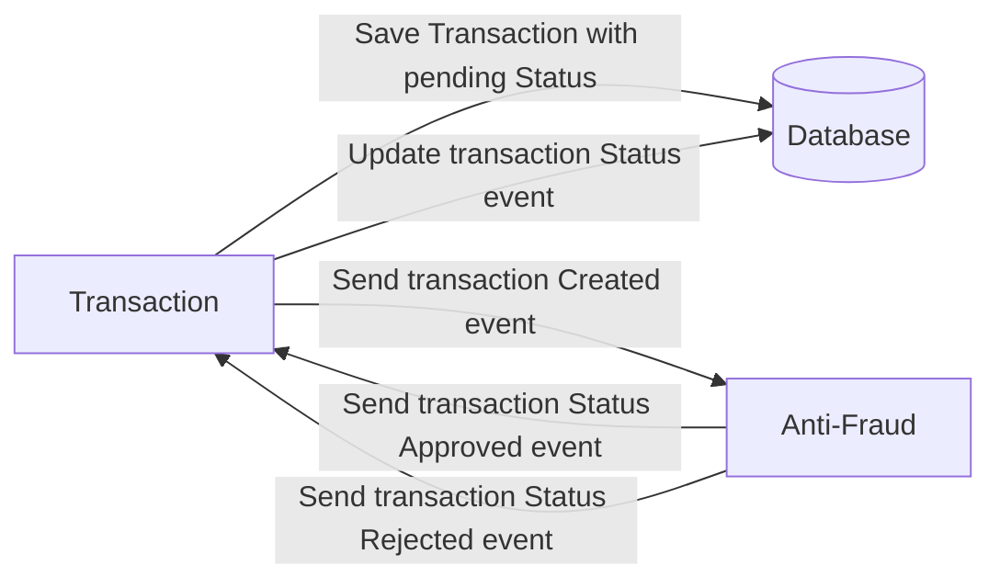
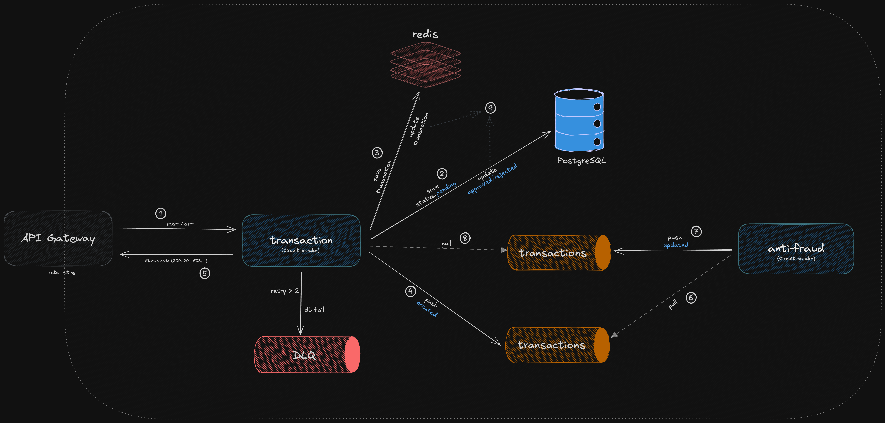

# Yape Code Challenge :rocket:

Our code challenge will let you marvel us with your Jedi coding skills :smile:. 

Don't forget that the proper way to submit your work is to fork the repo and create a PR :wink: ... have fun !!

- [Problem](#problem)

# Problem

Every time a financial transaction is created it must be validated by our anti-fraud microservice and then the same service sends a message back to update the transaction status.
For now, we have only three transaction statuses:

<ol>
  <li>pending</li>
  <li>approved</li>
  <li>rejected</li>  
</ol>

Every transaction with a value greater than 1000 should be rejected.



---

# ⚙️ Solution diagram



# 📚 List of operations

The endpoint documentation is located in the `docs` folder.
The documentation is written in **OpenAPI** format with Swagger.

| Method | Path                                  | Description        | Destination          |
|:-------|---------------------------------------|--------------------|----------------------|
| POST   | /transactions                         | Create Transaction | transaction          |
| GET    | /transactions/{transactionExternalId} | View Transaction   | transaction -> cache |

# 📦 Microservices architecture

The architecture used in the services is **DDD** (Domain-Driven Design), whose main focus is to place the business domain at the center of the design. 

```
transaction/
├── src/                      
│   ├── domain/                    
│   │   ├── entities/              
│   │   ├── value-objects/       
│   │   ├── repositories/       
│   │   ├── services/    
│   │   ├── events/              
│   │   └── exceptions/    
│   ├── application/          
│   │   ├── use-cases/         
│   │   ├── usecase/  
│   ├── infrastructure/          
│   │   ├── persistence/      
│   │   └── subscriber/   
│   ├──  index.ts
│   ├── presentation/                  
│   └── shared/                  
│       ├── domain/
│       │   ├── value-objects/
│       │   │   ├── Uuid.ts          
│       ├── infrastructure/
│       └── application/│                                                     
└── docs/                                                    
```

# 🧩 Future Improvements and Technical Considerations

During the challenge, priority was given to delivering a functional solution,
but there are several aspects that could be improved to make the solution more robust and resilient:
- **Idempotence:** Avoid transaction duplication in case of retries or failures.
- **Outbox Pattern:** Add this pattern to ensure consistency between the database and the messaging system.
- **Saga Pattern:** Add this pattern to handle distributed transactions and ensure eventual consistency (reversing failed operations).
- **Secret Management:** Use a secret manager to handle credentials.
- **DLQ Reprocessing:** Implement a job or manual process that reprocesses messages.
- **Testing:** Add unit and integration tests to ensure code quality.
- **Monitoring:** Implement monitoring tools to track application performance.

